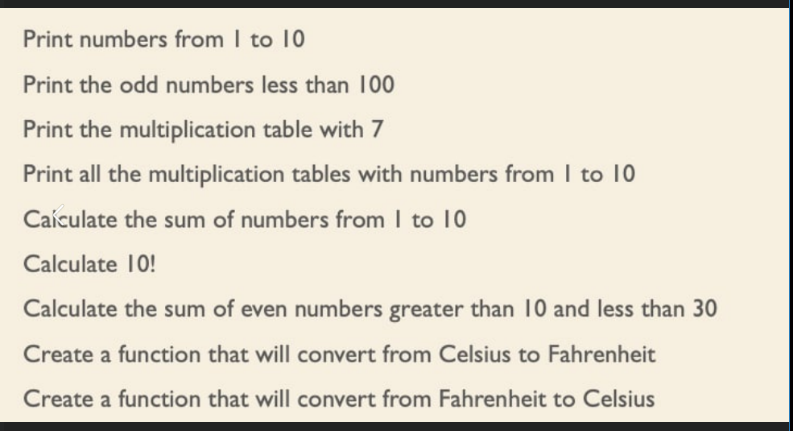

## 1. print numbers from 1 to 10
<details><summary>Solution</summary>

```js
const printNumber = (n, m) => {
  for (; n <= m; n++) {
    console.log(n);
  }
};
//Print numbers from 1 to 10
printNumber(1, 10);
```
</details>

## 2. print the odd numbers less than 100
<details><summary>Solution</summary>

```js
const printOddNumbers = (n, m) => {
  for (; n <= m; n++) {
    if (n % 2 != 0 && n > 0) {
      console.log(n);
    }
  }
};
// print the odd numbers less than 100
printOddNumbers(1, 100);
```
</details>

## 3. print multiplication table with 7
<details><summary>Solution</summary>

```js
const printMultiplicationTable = (n) => {
  for (let i = 1; i <= 10; i++) {
    console.log(`${n} x ${i} = ${n * i}`);
  }
};
// print multiplication table with 7
printMultiplicationTable(7);
```
</details>

## 4.print all the multiplication tables with numbers from 1 to 10
<details><summary>Solution</summary>

```js
const printMultiplicationTables = (n, m) => {
  for (let i = n; i <= m; i++) {
    console.log(`Multiplication table for ${i}:`);
    for (let j = 1; j <= 10; j++) {
      console.log(`${i} x ${j} = ${i * j}`);
    }
    console.log();
  }
};
// print all the multiplication tables with numbers from 1 to 10
printMultiplicationTables(1, 10);
```
</details>

## 5.calculate the summ of numbers from 1 to 10
<details><summary>Solution</summary>

```js
const printSummRangeNumbers = (n, m) => {
  const summRangeNumbers = (n, m) => {
    let result = 0;
    for (; n <= m; n++) {
      result += n;
    }
    return result;
  };
  console.log(summRangeNumbers(n, m));
};
// calculate the summ of numbers from 1 to 10
printSummRangeNumbers(1, 10);
```
</details>

## 6.calculate 10!
<details><summary>Solution</summary>

```js
const printCalculateFactorial = (n) => {
  const calculateFactorial = (n) =>
    n === 0 || n === 1 ? 1 : n * calculateFactorial(n - 1);
  console.log(calculateFactorial(n));
};
// calculate 10!
printCalculateFactorial(10);
```
</details>

## 7.calculate the sum of even numbers greater than 10 and less than 30
<details><summary>Solution</summary>

```js
const printSummEvenNumberRange = (n, m) => {
  const summEvenNumberRange = (n, m) => {
    let result = 0;
    for (; n <= m; n++) {
      if (n % 2 === 0 && n > 0) {
        result += n;
      }
    }
    return result;
  };
  console.log(summEvenNumberRange(n, m));
};
// calculate the sum of even numbers greater than 10 and less than 30
printSummEvenNumberRange(10, 30);
```
</details>

## 8.create a function that will convert from celsius to fahrenheit
<details><summary>Solution</summary>

```js
const printCelsiusToFahrenheit = (celsius) => {
  const celsiusToFahrenheit = (celsius) => (celsius * 9) / 5 + 32;
  console.log(celsiusToFahrenheit(celsius));
};
// create a function that will convert from celsius to fahrenheit
printCelsiusToFahrenheit(45);
```
</details>

## 9.create a function that will convert from fahrenheit to celsius
<details><summary>Solution</summary>

```js
const printFahrenheitToCelsius = (fahrenheit) => {
  const fahrenheitToCelsius = (fahrenheit) => ((fahrenheit - 32) * 5) / 9;
  console.log(fahrenheitToCelsius(fahrenheit));
};
// create a function that will convert from celsius to fahrenheit
printFahrenheitToCelsius(120);
```
</details>
